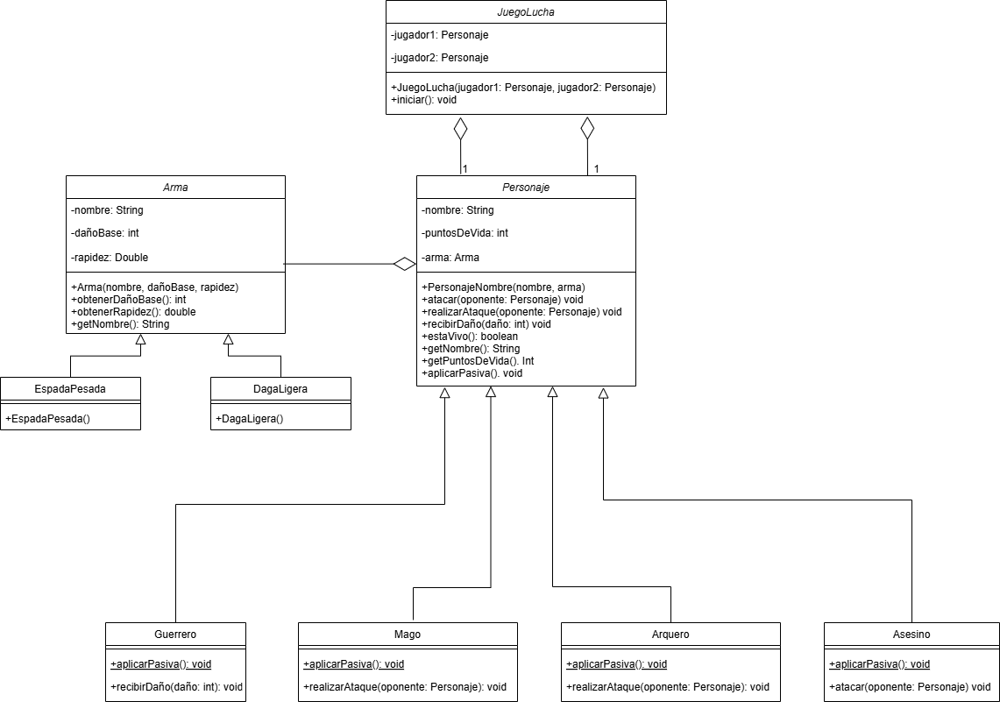

# Juego de Lucha en Java 

## Análisis Inicial
Al inicio queria hacer algo muy parecido al ejemplo dado pero tambien queria darle algo de complejidad, por ello llegue a la creacion de distintas clases con pasivas y ademas agregar un arma seleccionable a cada uno para mayor versatilidad, entonces primero fue tener al personaje y al arma, para despues tener las subclases y las armas especificas, el pensar las habilidades de cada una fue dificil ya que debian estar medianamente balanceadas entre si, para que alguna no fuese mucho mejor que las demas, ya de ahi fue generar el flujo del juego, ademas de hacer un Main que permitiera elegir a cada jugar que clase y que arma quiere, ademas de que el  flujo del juego no sea instantaneo, sino que los turnos tengan un tiempo para que se vayan dando, y asi el usuario pueda ver como se va dando cada uno.

Despues se penso en como hacerle unos cambios al juego, y por ello se creo que los ataques se definen por una tirada de dados, y si el ataque es efectivo o no es segun el numero sacado, ademas de poner el tema de los criticos si el numero es el indicado, para añadirle otra parte mas de suerte al juego, haciendo asi un juego donde la eleccion de clase y arma es importante, pero un factor importante es la suerte de cada jugador.

---

## Explicación del Código
### Estructura Principal
El proyecto se organiza en dos paquetes principales:
- **`personajes`**: Contiene las clases de personajes (`Guerrero`, `Mago`, `Arquero`, `Asesino`) y la clase abstracta `Personaje`.
- **`armas`**: Incluye las clases de armas (`EspadaPesada`, `DagaLigera`) y la clase abstracta `Arma`.

### Clases Clave
1. **`Personaje`** (Clase abstracta):
   - Atributos: `nombre`, `puntosDeVida`, `arma`.
   - Métodos: `atacar()`, `recibirDaño()`, `aplicarPasiva()` (abstracto), y métodos de acceso.
   - **Herencia**: Cada personaje concreto implementa su pasiva y lógica de ataque específica.

2. **`JuegoLucha`**:
   - Controla el flujo del combate.
   - Alterna turnos entre jugadores hasta que uno pierde todos sus puntos de vida.

3. **`Arma`** (Clase abstracta):
   - Define propiedades comunes: `dañoBase` y `rapidez` (probabilidad de ataque extra).
   - **Polimorfismo**: Las subclases (`EspadaPesada`, `DagaLigera`) definen valores concretos.

### Mecánicas Destacadas
- **Pasivas de personajes**:
  - *Guerrero*: Reduce 10% del daño recibido.
  - *Mago*: Críticos en tiradas 11 y 12.
  - *Arquero*: Solo falla en tiradas ≤4.
  - *Asesino*: 30% de probabilidad de ataque adicional.
- **Sistema de armas**:
  - `EspadaPesada`: Daño alto (25) pero baja rapidez (20%).
  - `DagaLigera`: Daño moderado (20) con alta rapidez (60%).

---

## Diagrama de Clases

### Explicación del Diagrama
- **Relaciones**:
  - **Agregación** (`Personaje` ➔ `Arma`): Un `Personaje` utiliza un `Arma`, pero el arma puede existir independientemente.
  - **Herencia**: Las subclases de `Personaje` y `Arma` heredan atributos y métodos de sus clases base.

- **Estructura**:
  - `JuegoLucha` contiene dos instancias de `Personaje`.
  - Cada `Personaje` tiene un `Arma` y métodos para atacar y aplicar pasivas.
  - Las subclases de `Personaje` sobrescriben `aplicarPasiva()` y `realizarAtaque()`.

---

## Casos de Ejecución
### Caso 1: Asesino vs Guerrero
    Elige clase del Jugador 1 (Guerrero/Mago/Arquero/Asesino): 
    Guerrero: Reduce 10% el daño recibido.
    Mago: Crítico con tiradas de 11 y 12.
    Arquero: Menor probabilidad de fallo.
    Asesino: 30% de posibilidad de doble ataque.
    Asesino
    Nombre: Asesino
    Elige arma: 1) Espada Pesada  2) Daga Ligera
    2
    Elige clase del Jugador 2 (Guerrero/Mago/Arquero/Asesino): 
    Guerrero: Reduce 10% el daño recibido.
    Mago: Crítico con tiradas de 11 y 12.
    Arquero: Menor probabilidad de fallo.
    Asesino: 30% de posibilidad de doble ataque.
    Guerrero
    Nombre: Guerrero
    Elige arma: 1) Espada Pesada  2) Daga Ligera
    1
    Asesino (Asesino) activa su pasiva: Golpe sorpresa.
    Guerrero (Guerrero) activa su pasiva: Resistencia física.

    --- COMBATE INICIA ---

    Turno de Asesino
    Asesino lanza el dado... (1)
    Asesino falló el ataque.
    Asesino ataca una segunda vez gracias a la rapidez del arma.
    Asesino lanza el dado... (11)
    Asesino ataca con Daga Ligera
    Guerrero recibe 18 de daño. Vida restante: 82

    Turno de Guerrero
    Guerrero lanza el dado... (12)
    Guerrero hizo un ATAQUE CRÍTICO con Espada Pesada!
    Asesino recibe 30 de daño. Vida restante: 70

    Turno de Asesino
    Asesino lanza el dado... (6)
    Asesino falló el ataque.
    Asesino hace un segundo ataque gracias a su pasiva.
    Asesino lanza el dado... (1)
    Asesino falló el ataque.
    Asesino ataca una segunda vez gracias a la rapidez del arma.
    Asesino lanza el dado... (8)
    Asesino ataca con Daga Ligera
    Guerrero recibe 18 de daño. Vida restante: 64

    Turno de Guerrero
    Guerrero lanza el dado... (7)
    Guerrero ataca con Espada Pesada
    Asesino recibe 25 de daño. Vida restante: 45

    Turno de Asesino
    Asesino lanza el dado... (5)
    Asesino falló el ataque.
    Asesino ataca una segunda vez gracias a la rapidez del arma.
    Asesino lanza el dado... (10)
    Asesino ataca con Daga Ligera
    Guerrero recibe 18 de daño. Vida restante: 46

    Turno de Guerrero
    Guerrero lanza el dado... (12)
    Guerrero hizo un ATAQUE CRÍTICO con Espada Pesada!
    Asesino recibe 30 de daño. Vida restante: 15

    Turno de Asesino
    Asesino lanza el dado... (6)
    Asesino falló el ataque.
    Asesino ataca una segunda vez gracias a la rapidez del arma.
    Asesino lanza el dado... (5)
    Asesino falló el ataque.

    Turno de Guerrero
    Guerrero lanza el dado... (7)
    Guerrero ataca con Espada Pesada
    Asesino recibe 25 de daño. Vida restante: 0
    Guerrero ataca una segunda vez gracias a la rapidez del arma.
    Guerrero lanza el dado... (1)
    Guerrero falló el ataque.

    --- COMBATE FINALIZADO ---
    Guerrero ganó.
- **Asesino** (Daga Ligera):
  - Aprovecha su pasiva (30% de ataque extra) y la rapidez del arma (60%).
  - Ejemplo: En un turno, falla el primer ataque pero realiza dos ataques adicionales.
- **Guerrero** (Espada Pesada):
  - Reduce el daño recibido en 10% (ej: 20 de daño → 18).
  - Críticos con Espada Pesada infligen 30 de daño (25 * 1.2).
- **Resultado**: Como se puede ver, el guerrero mitiga mejor el daño gracias a su pasiva, y el asesino gracias a esa posibilidad de hacer 3 ataques pudo atacar en ocasiones donde fallo el primero e incluso el segundo ataque, viendo asi que el flujo de combate es el correcto.

### Caso 2: Arquero vs Mago
    Elige clase del Jugador 1 (Guerrero/Mago/Arquero/Asesino): 
    Guerrero: Reduce 10% el daño recibido.
    Mago: Crítico con tiradas de 11 y 12.
    Arquero: Menor probabilidad de fallo.
    Asesino: 30% de posibilidad de doble ataque.
    Arquero
    Nombre: Arquero
    Elige arma: 1) Espada Pesada  2) Daga Ligera
    2
    Elige clase del Jugador 2 (Guerrero/Mago/Arquero/Asesino): 
    Guerrero: Reduce 10% el daño recibido.
    Mago: Crítico con tiradas de 11 y 12.
    Arquero: Menor probabilidad de fallo.
    Asesino: 30% de posibilidad de doble ataque.
    Mago
    Nombre: Mago 
    Elige arma: 1) Espada Pesada  2) Daga Ligera
    1
    Arquero (Arquero) activa su pasiva: Precisión mejorada.
    Mago (Mago) activa su pasiva: Poder arcano.

    --- COMBATE INICIA ---

    Turno de Arquero
    Arquero lanza el dado... (5)
    Arquero ataca con Daga Ligera
    Mago recibe 20 de daño. Vida restante: 80

    Turno de Mago
    Mago lanza el dado... (2)
    Mago falló el ataque.

    Turno de Arquero
    Arquero lanza el dado... (6)
    Arquero ataca con Daga Ligera
    Mago recibe 20 de daño. Vida restante: 60

    Turno de Mago
    Mago lanza el dado... (11)
    Mago hizo un ATAQUE CRÍTICO con Espada Pesada!
    Arquero recibe 30 de daño. Vida restante: 70

    Turno de Arquero
    Arquero lanza el dado... (7)
    Arquero ataca con Daga Ligera
    Mago recibe 20 de daño. Vida restante: 40
    Arquero ataca una segunda vez gracias a la rapidez del arma.
    Arquero lanza el dado... (2)
    Arquero falló el ataque.

    Turno de Mago
    Mago lanza el dado... (8)
    Mago ataca con Espada Pesada
    Arquero recibe 25 de daño. Vida restante: 45

    Turno de Arquero
    Arquero lanza el dado... (9)
    Arquero ataca con Daga Ligera
    Mago recibe 20 de daño. Vida restante: 20
    Arquero ataca una segunda vez gracias a la rapidez del arma.
    Arquero lanza el dado... (3)
    Arquero falló el ataque.

    Turno de Mago
    Mago lanza el dado... (7)
    Mago ataca con Espada Pesada
    Arquero recibe 25 de daño. Vida restante: 20

    Turno de Arquero
    Arquero lanza el dado... (6)
    Arquero ataca con Daga Ligera
    Mago recibe 20 de daño. Vida restante: 0

    --- COMBATE FINALIZADO ---
    Arquero ganó.
- **Arquero** (Daga Ligera):
  - Menor probabilidad de fallo (solo en tiradas ≤4).
  - Ataques rápidos (ej: dos ataques en un turno).
- **Mago** (Espada Pesada):
  - Críticos en tiradas 11 y 12 (ej: 25 * 1.2 = 30 de daño).
- **Resultado**: Como se pudo ver, el arquero pudo fallar algunos ataques pero debido a su pasiva de fallar menos pudo atacar, y el mago gracias a su pasiva de criticos mas sencillos, pudo hacer un critico al sacar 11, ademas se ve que todo el flujo del combate funciona bien entre ambos.

